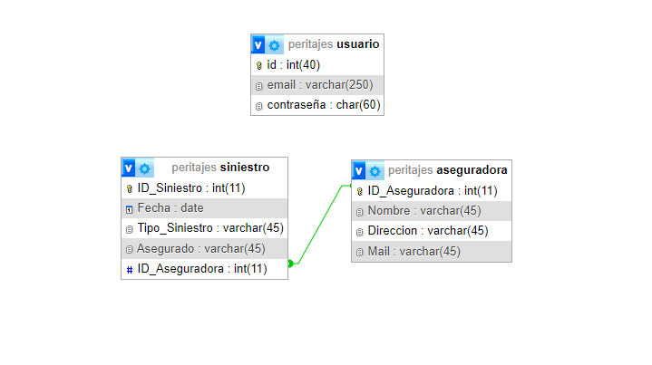

# peritajeApp (2° entrega)

Trabajo Práctico Especial para la materia Web 2 de la Tecnicatura Universitaria en Desarrollo de Aplicaciones Informáticas, UNICEN.

## Tema

Creamos una base de datos, modelando la relación (1 a N), Aseguradora-Siniestro, con el fin de facilitar a los usuarios (peritos) el registro con la información sobre sus siniestros y aseguradoras.

## Despliegue del Sitio

Requerimientos:
Tener instalado XAMPP.

Inicializar: 
Apache y MySQL

Tener instalado XAMPP.

## Pasos para Desplegar
Clonar el repositorio remoto desde la terminal en tu repositorio local o descarga los archivos ZIP y descomprímelos en tu computadora dentro de la carpeta del proyecto a C:\xampp\htdocs (windows) o C:\opt\lampp\htdocs(linux).

## Clonar repositotio: 
(Tuvimos inconvenientes con este repositorio asociado a la planilla de entrega, por lo tanto, ante cualquier error durante la ejecucion dejamos a continuación un enlace alternativo para clonar)

git clone https://github.com/PamelaLoustaunau/peritajeApp.git 

## Acceso Administrador
-Usuario: webadmin -Contraseña: admin

## Diagrama

## Integrantes

- María Soledad Cedro  solcedro82@gmail.com

- Pamela Loustaunau  pamelitaloustaunau@gmail.com

