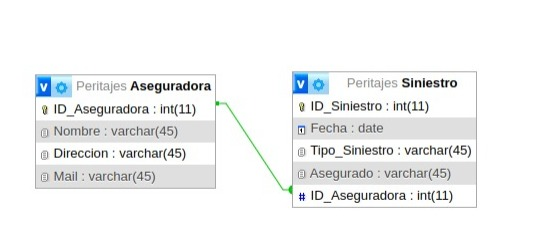

# Web2-TPE (1° entrega)

Trabajo Práctico Especial para la materia Web 2 de la Tecnicatura Universitaria en Desarrollo de Aplicaciones Informáticas, UNICEN.

## Tema

Creamos una base de datos, modelamos la relación 1 a N: Aseguradora-Siniestro, con el fin de 
que los usuarios puedan compartir información sobre sus siniestros, 
permitiendo al perito tener información y registro de los mismos.

## Diagrama

## Integrantes

- María Soledad Cedro  solcedro82@gmail.com
- Pamela Loustaunau  pamelitaloustaunau@gmail.com
